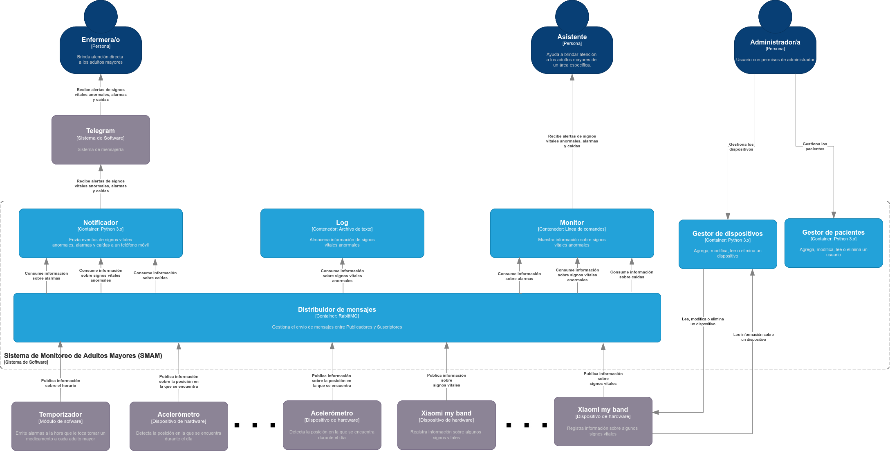

# Arquitectura Publica-Suscribe

## Sistema de Monitoreo de Adultos Mayores (SMAM)

Existe un asilo llamado Divina Providencia en el que viven un grupo de adultos mayores, parte del personal que trabaja en el asilo, entre otras tareas, se dedica a atender las necesidades de los adultos mayores y a monitorear su estado de salud.

La fundación Catalina Huffmann, que es una fundación altruista en la región, decidió, a manera de donación, desarrollarle al asilo un sistema de cómputo para realizar las actividades de monitoreo del estado de salud de los adultos mayores de forma (semi-)automática. Para ello, la fundación utilizó un conjunto de dispositivos “wearables” que portan cada uno de los adultos mayores. Mediante el envío de información sobre ritmo cardiaco, presión arterial y temperatura, estos dispositivos “wearables” permiten monitorear en tiempo real a cada uno de los adultos mayores y de esta forma ser más eficientes en la prevención de incidencias.

**A partir del mes de enero del 2021 las políticas de cuidados y de salud han sido modificadas y se tienen que realizar un mantenimiento evolutivo del sistema actual considerando los siguientes requerimientos:**

- Como enfermera/o necesito recibir alertas en mi teléfono móvil cuando un adulto mayor se haya caído, de forma que pueda brindarle atención inmediata.
- Como asistente de área necesito visualizar en mi monitor una alerta cuando un adulto mayor se haya caído, de forma que pueda ayudar a asegurar que se le brinde atención inmediata.
- Como enfemera/o necesito recibir alertas en mi teléfono móvil cuando un adulto mayor requiera tomar un medicamento, de forma que pueda dárselo de forma inmediata.
- Como asistente de área necesito visualizar en mi monitor una alerta cuando un adulto mayor requiera tomar un medicamento, de forma que pueda ayudar a asegurar que se le esto se haga de forma inmediata.

En la siguiente figura se muestra el diseño de la propuesta de solución del desarrollo para el SMAM.



## Estructura del proyecto

Este repositorio contiene los siguientes directorios y archivos:

```bash
    ├── config                                    # carpeta de configuraciones
    |  ├── bashrc                                 # archivo de configuración para el contenedor del sistema
    ├── smam-app                                  # carpeta de los elementos que integran el sistema
    |  ├── docs                                   # carpeta de documentación
    |     ├── view.png                            # vista de solución del mantenimiento evolutivo
    |  ├── publicadores                           # publicadores del sistema
    |     ├── src                                 # código fuente de los publicadores
    |        ├── devices                          # archivos de definición de dispositivos
    |           ├── accelerometer.py              # simulador del dispositivo de hardware acelerómetro
    |              ├── timer.py                   # simulador del dispositivo de hardware cronómetro
    |              ├── xiaomi_my_band.py          # simulador de dispositivo de hardware Xiaomi
    |           ├── helpers                       # archivos auxiliares del sistema
    |              ├── __init__.py                # indica la definición de módulo python
    |              ├── publicador.py              # archivo auxiliar de comunicación con el distribuidor de mensajes 
    |           ├── __init__.py                   # indica la definición de módulo python
    |           ├── patient.py                    # representación de un adulto mayor en el sistema
    |        ├── main.py                          # archivo principal de ejecución de publicadores
    |  ├── suscriptores                           # suscriptores del sistema
    |     ├── helpers                             # archivos auxiliares de los suscriptores
    |        ├── __init__.py                      # indica la definición de módulo
    |        ├── warning.py                       # filtro de eventos para seleccionar la advertencia correspondiente
    |     ├── monitor.py                          # suscriptor que muestra en pantalla las alertas del sistema
    |     ├── notifier.py                         # suscriptor que notifica a un(a) enfermero(a) en particular
    |     ├── record.py                           # suscriptor que actualiza el expediente de un adulto mayor en particular
    |  ├── .gitignore                             # exclusiones de git
    |  ├── requirements.txt                       # dependencias del sistema
    ├── docker-compose.yml                        # archivo para comunicar el sistema con el servicio de RabbitMQ
    ├── Dockerfile                                # archivo para encapsular el sistema en un contenedor Docker
    ├── README.md                                 # archivo actual
```

## Prerrequisitos

- Instalar Docker. Seguir los pasos de la documentación oficial para instalar [Docker](https://docs.docker.com/get-docker/) en su sistema operativo.

- Instalar Docker Compose. Seguir los pasos de la documentación oficial para instalar [Docker Compose](https://docs.docker.com/compose/install/) en su sistema operativo.

- Clonar el repositorio:
   ```shell
   $ git clone https://github.com/Vacilon/smam-publish-subscriber.git
   $ cd smam-publish-subscriber
   ```

- Generar el ambiente del sistema a partir de contenedores Docker:
   ```shell
   $ docker-compose build
   ```

## Ejecución

Sigue las siguientes instrucciones para ejecutar los diferentes componentes del sistema.

- Ejecutar el ambiente del sistema:
   ```shell
   $ docker-compose up -d
   ```

> **Nota:** Cada componente debe ser ejecutado en una terminal independiente

- Entrar al contenedor del sistema:
   ```shell
   $ docker-compose exec smam-app bash
   ```

### Publicador

- Ejecutar la simulación del sistema:
   ```shell
   $ main
   ```

### Suscriptores

**Notificador de alertas**

- Ejecutar el suscriptor notificador:
   ```shell
   $ notifier
   ```

**Log**

- Ejecutar el suscriptor log:
   ```shell
   $ record
   ```

**Monitor**

- Ejecutar el suscriptor monitor:
   ```shell
   $ monitor
   ```

## Versión

3.0.0 - Abril 2022

## Autores

> 2.2.0 - Marzo 2022

* **Perla Velasco**
* **Yonathan Martínez**
* **Sergio Salazar**
* **Jorge Solis**

> 3.0.0 - Abril 2022

* **Emmanuel Ibarra**
* **Cristian Sánchez**
* **Miguel Fernández**
* **Rodrigo Vega**

## Notas

- Actualmente el notificador envía las advertencias a un grupo realizado por el equipo.
    ```shell
    archivo: notifier.py
    74      self.token = "5112577859:AAEcbHUf_cAICXVc8F2BA8y6XnESmRJkkEk"
    75      self.chat_id = "-650846930"
    ```

- En Telegram, con el fin de probar el temporizador y prevenir el SPAM de mensajes, se evita que puedan mandarse más de 20 advertencias en un intervalo de 1 segundo. En consecuencia, se agregó un 'sleep' con un retardo de 4 segundos para ralentizar la frecuencia con la que se envían los mensajes.
    ```shell
    archivo: notifier.py
    104     time.sleep(4)
    ```

- Para que sean más notorios los resultados de la simulación y aumente la probabilidad de que el evento ocurra, se dejaron sólo 2 horas para la administración del medicamento a los adultos mayores.
    ```shell
    archivo: timer.py
    42      self.time = random.choice([4, 8])
    ```
