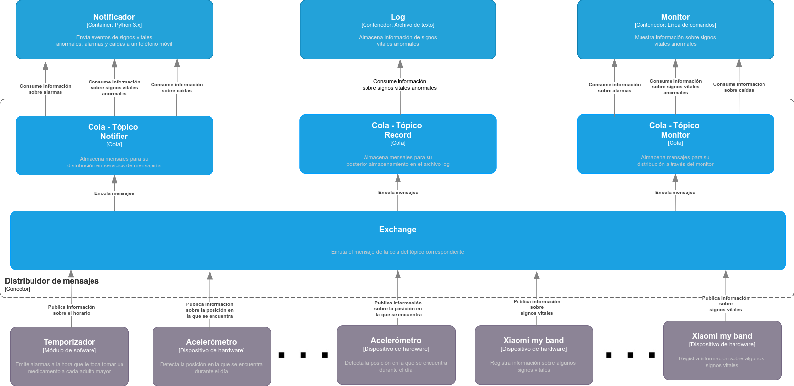

# Actualización de los diagramas para reflejar la nueva versión del sistema

## Vista de módulos

## Vista dinámica para Xiaomi my band

## Vista dinámica para Acelerómetro

## Vista dinámica para Temporizador

## Elementos de RabbitMQ

## Vista dinámica con los elementos de RabbitMQ para Xiaomi my band

## Vista dinámica con los elementos de RabbitMQ para Acelerómetro

## Vista dinámica con los elementos de RabbitMQ para Temporizador

